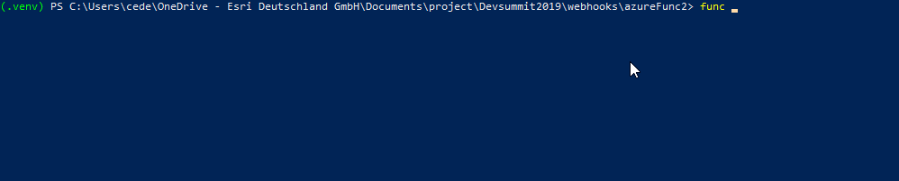

# Azure Serverless, Python API, Public Crowdsourced Weather, Integration in ArcGIS Online

Aim : Use Azure serverless functions to get public weather information from Netatmo API and push them in an ArcGIS Online hosted feature service with python.

Presented as part of the speed geeking session for the 2019 European Developer Summit

Result map :

# Steps :
## What is Netatmo :

## Netatmo API :

https://docs.microsoft.com/en-us/azure/azure-functions/functions-create-first-function-python

## Script :

## How to create an azure serverless function

Install the prerequisite

Create function on azure :

func init

func new

 func azure functionapp publish <function> --build remote

 Sample Dahsboard from geneva :
