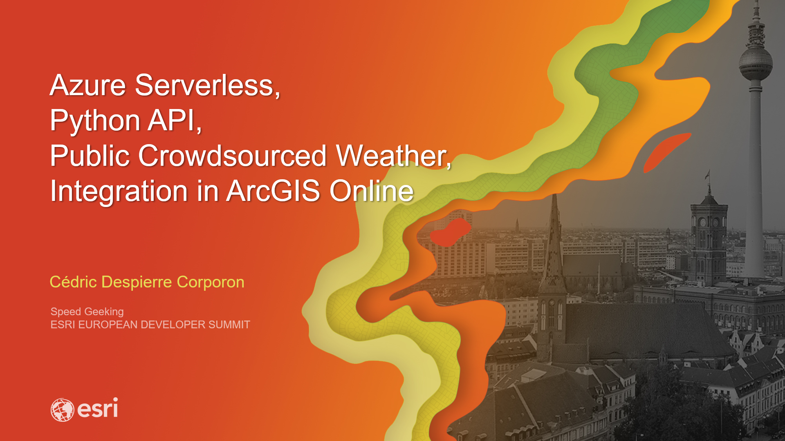
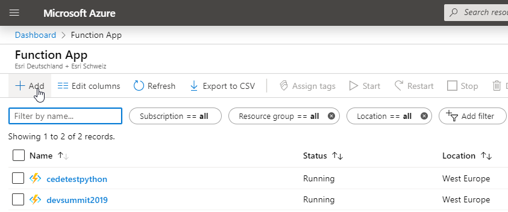
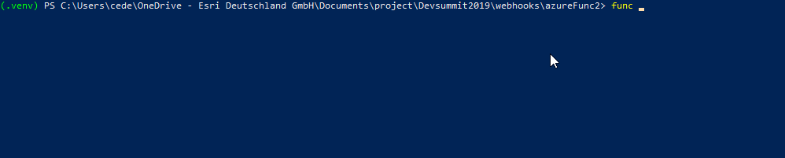
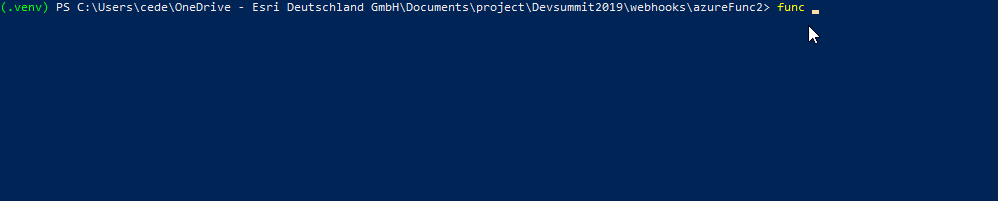
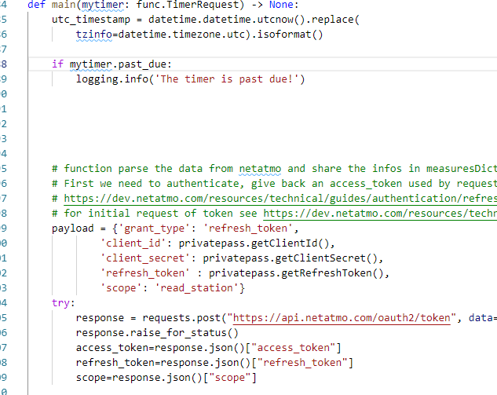
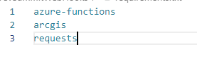
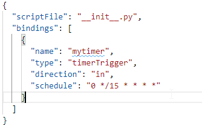
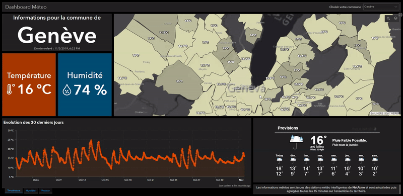

# Azure Serverless, Python API, Public Crowdsourced Weather, Integration in ArcGIS Online

Aim : Use Azure serverless functions to get public weather information from Netatmo API and push them in an ArcGIS Online hosted feature service with python.

Presented as part of the speed geeking session for the 2019 European Developer Summit

[Linkedin](https://www.linkedin.com/in/cedricdespierrecorporon/)

Result map :

https://esrich.maps.arcgis.com/home/webmap/viewer.html?webmap=4de5fab6d87149a5ad1d5a3ef716cfc8

# Steps :
## What is Netatmo :

https://www.netatmo.com/en-us/weather/weatherstation

## Netatmo API :

https://dev.netatmo.com/resources/technical/reference/weatherapi

## Script :

Check [NetAtmo.py](/NetAtmo.py)

## How to create an azure serverless function

#### Install the prerequisite

https://docs.microsoft.com/en-us/azure/azure-functions/functions-create-first-function-python

Install Python 3.6.8. This version of Python is verified with Functions. 3.7 and later versions are not yet supported.

Install Azure Functions Core Tools version 2.7.1575 or a later version.

Install the Azure CLI version 2.x or a later version.

Have an active Azure subscription.

If you don't have an Azure subscription, create a free account before you begin.

#### Azure Portal - Create function on azure :

#### Local console - func init

#### Local console - func new

#### paste your code in the main function

#### Edit requirements.txt and function.json

####  Local console - publish
 func azure functionapp publish <function> --build remote

##### Sample Dahsboard from Canton of Geneva :
